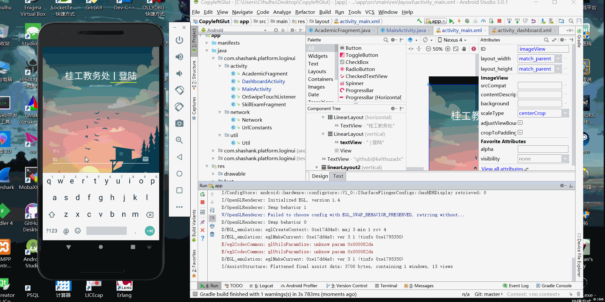
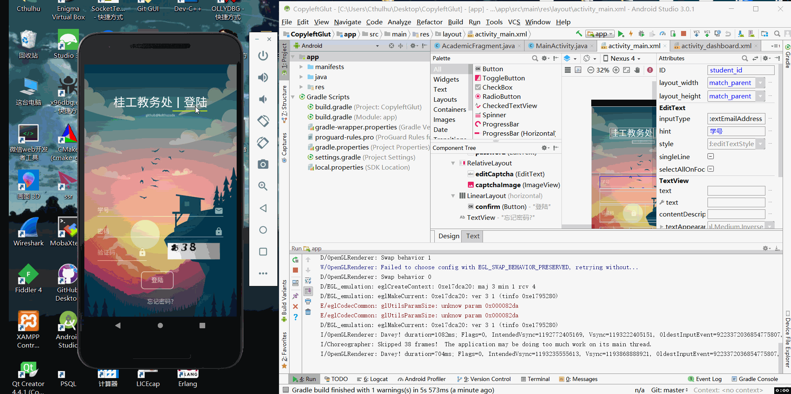

# Copylefted GLUT Academic App for Android

# Intro
This is an unofficial GLUT academic system for Android platform. Since official web sytem uses `http` protocol to transfer user data, we can intercept http package and analyse it, this application is based on my analysis(tremendously easy) and send reconstructed package to remote server. 

Now it supports querying academic inforamtion and skill exams. I'm busy developing another stuff, you can pull request to add more features if you are interested in this semi-demo;

# Screenshot

# License
Please feel free to copy/modify/redistribute it!